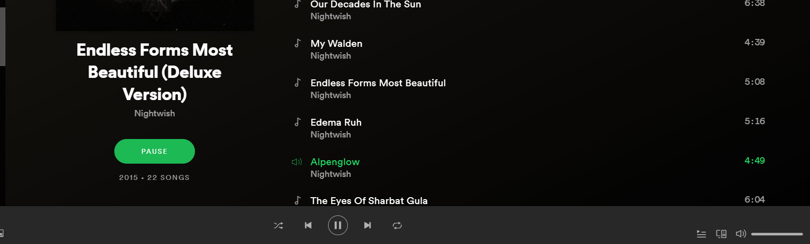
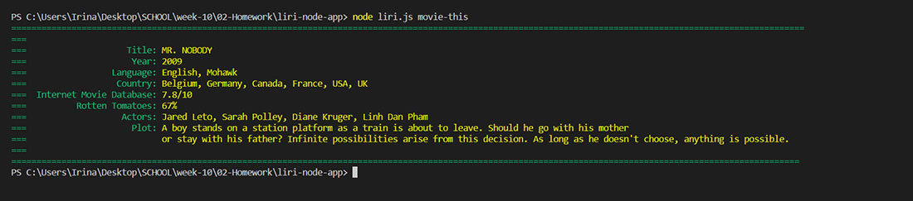
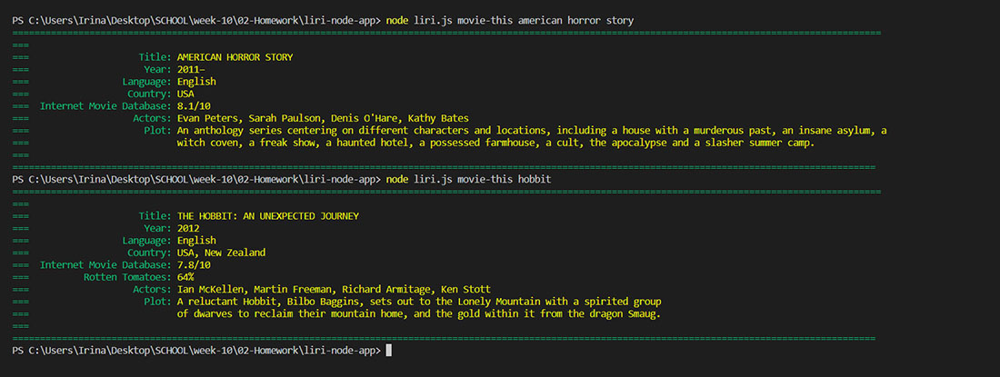
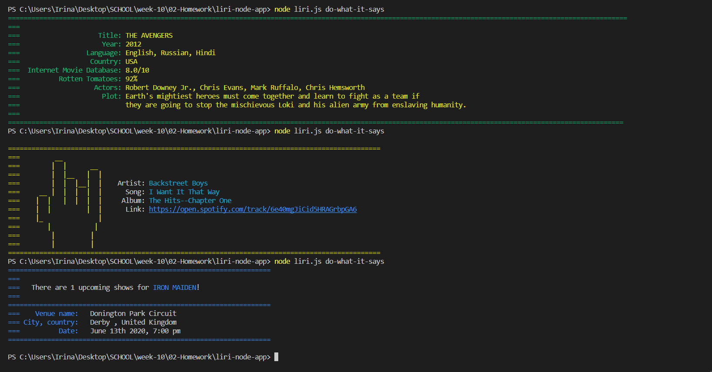

# LIRI Bot

### Overview

In this assignment, you will make LIRI. LIRI is like iPhone's SIRI. However, while SIRI is a Speech Interpretation and Recognition Interface, LIRI is a _Language_ Interpretation and Recognition Interface. LIRI will be a command line node app that takes in parameters and gives you back data.

### LIRI can:
Use the following commands:

* search Spotify for songs
    * node liri.js concert-this [band-name]
* search Bands in Town for concerts
    * node liri.js spotify-this-song [song-name]
* search OMDB for movies
    * node liri.js movie-this [movie-name]
* randomize choise between the three
    * node liri.js do-what-it-says
* write all the search requests in a .txt fie
    * no need to run any command, he will do it for you 

### APIs used

* Spotify
* Bands In Town
* OMDB
* Moment.js

### Packages Used

* **axios** - Promise based HTTP client for the browser and node.js NPM package
* **chalk** - Terminal strings styling NPM package
* **dotenv** - Loads environment variables from .env file NPM package
* **moment** - Parse, validate, manipulate, and display dates NPM package
* **node-spotify-api** - A simple wrapper for the spotify api NPM package

[Clik here for video demo of the project](assets/videos/video.mp4)

### Screeshots walktrough

#### Entry screen, command ``` node liri.js ```


#### Search Bands In Town, command ``` node liri.js concert-this ``` - without user input, searching for default value


#### Search Bands In Town, command ``` node liri.js concert-this judas pries``` - with user input


#### Search Spotify, command ``` node liri.js spotify-this-song``` - without user input, searching for default value


#### Search Spotify, command ``` node liri.js spotify-this-song alpenglow``` - with user input


#### clicking on Spotify link


#### listening to the song



#### Search OMDB, command ``` node liri.js movie-this``` - without user input, searching for default value



#### Search OMDB, command ``` node liri.js movie-this hobbit``` - with user input (in case of ``` node liri.js american horror story``` there is no rating for rotten tomatoes diplayed)



#### Let Liri choose, he will randomize the choise between the values written in random.txt file. 
#### Command ``` node liri.js do-what-it-says```




